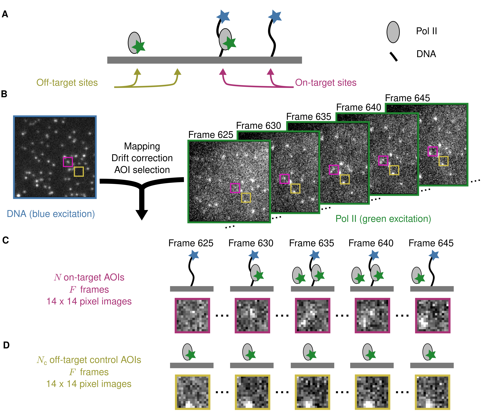
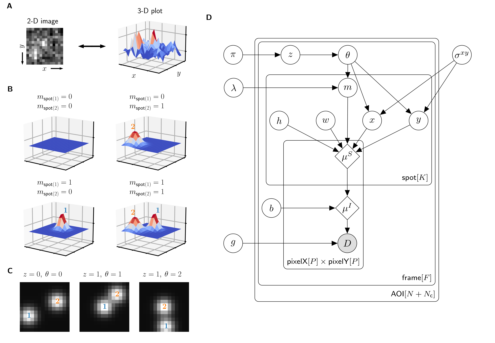
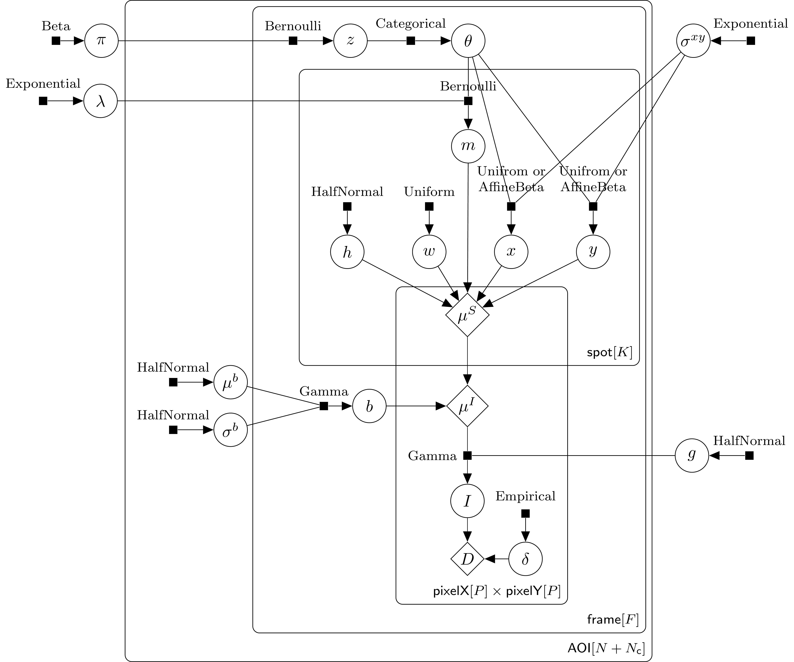
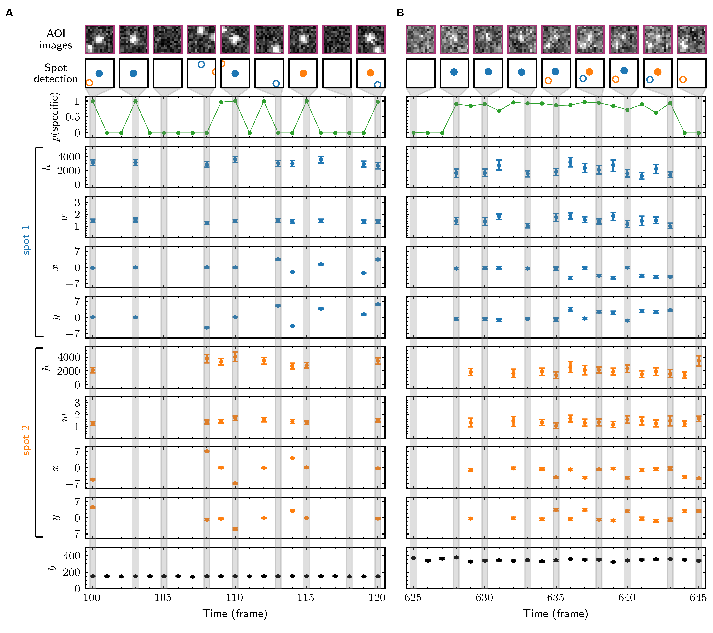
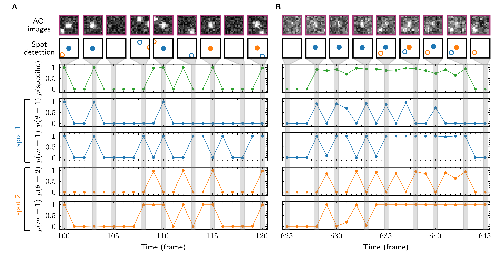
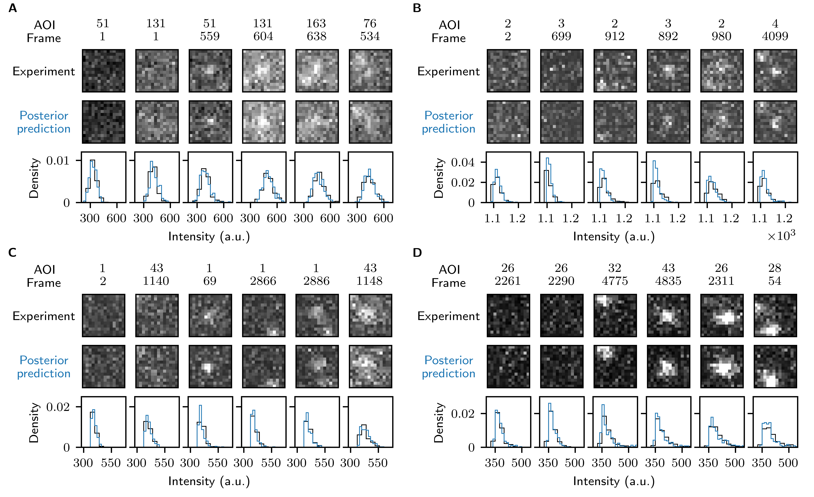
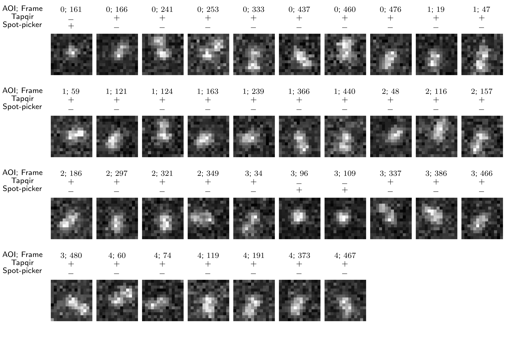
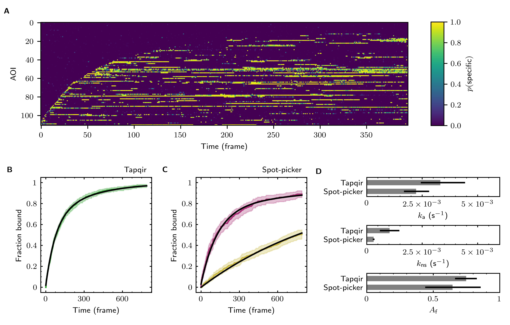
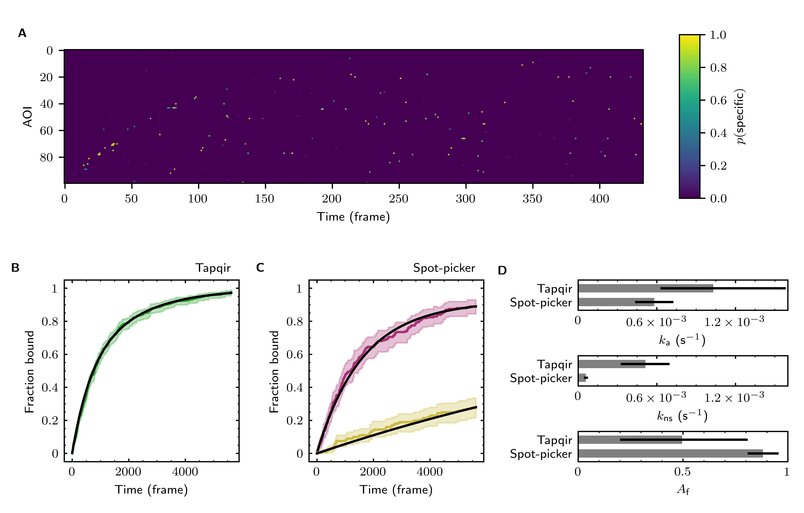

Install Tapqir
--------------

Follow `these instructions <https://tapqir.readthedocs.io/en/latest/install/index.html>`_ to install Tapqir.

Download data
-------------

Analysis output of experimental data is stored in ``experimental`` folder:

* DatasetA: ``experimental/DatasetA``
* DatasetB: ``experimental/DatasetB``
* DatasetC: ``experimental/DatasetC``
* DatasetD: ``experimental/DatasetD``
* DatasetA: ``experimental/P10DatasetA`` (10x10 AOIs)
* DatasetA: ``experimental/P6DatasetA`` (6x6 AOIs)

Analysis output of simulated data is stored in ``simulations`` folder:

* Supplemental Data 1: ``simulations/lamda*``
* Supplemental Data 2: ``simulations/seed*``
* Supplemental Data 3: ``simulations/height*``
* Supplemental Data 4: ``simulations/negative*``
* Supplemental Data 5: ``simulations/kon*``
* Supplemental Data 6: ``simulations/sigma*``

These folders contain following files:

* ``data.tpqr`` AOI images
* ``cosmos-channel0-params.tpqr``: posterior parameter distributions
* ``cosmos-channel0-summary.csv``: summary of global parameter values
* ``.tapqir``: folder containing internal files such as last model checkpoint, configuration file, and log files.

Figure 1
--------

   
   Example CoSMoS experiment.

Image file: `figures/cosmos_epxeriment/cosmos_experiment.png <figures/cosmos_epxeriment/cosmos_experiment.png>`_

Figure 2
--------

   
   Depiction of the cosmos probabilistic image model and model parameters.

Image file: `figures/graphical_model.png <figures/graphical_model.png>`_

To generate panels A, B, and C in the image, run (outpus ``figures/graphical_model.svg`` vector image)::

  python scripts/figures/graphical_model.py

Input data:

* ``experimental/DatasetA``

Graphical model in panel D is located at ``figures/graphical_model.pdf``.

Figure 2–Figure supplement 1
^^^^^^^^^^^^^^^^^^^^^^^^^^^^

   
   Extended graphical representation of the cosmos generative probabilistic model.

Image file: `figures/graphical_model_extended.png <figures/graphical_model_extended.png>`_

Figure 2–Figure supplement 2
^^^^^^^^^^^^^^^^^^^^^^^^^^^^

.. figure:: figures/graphical_model_xy.png
   :alt: Figure 2–Figure supplement 2
   :width: 300
   
   The prior distributions for x and y spot position parameters.

Image file: `figures/graphical_model_xy.png <figures/graphical_model_xy.png>`_

To generate the image file, run::

  python scripts/figures/graphical_model_xy.py

Figure 3
--------

   
   Tapqir analysis and inferred model parameters.

Image file: `figures/tapqir_analysis.png <figures/tapqir_analysis.png>`_

To generate the image file, run::

  python scripts/figures/tapqir_analysis.py

Input data:

* ``simulations/lamda0.5`` (panel A)
* ``experimental/DatasetA`` (panel B)

Figure 3-Figure supplement 1
^^^^^^^^^^^^^^^^^^^^^^^^^^^^

   
   Calculated spot probabilities.

Image file: `figures/tapqir_analysis_probs.png <figures/tapqir_analysis_probs.png>`_

To generate the image file, run::

  python scripts/figures/tapqir_analysis_probs.py

Input data:

* ``simulations/lamda0.5`` (panel A)
* ``experimental/DatasetA`` (panel B)

Figure 3-Figure supplement 2
^^^^^^^^^^^^^^^^^^^^^^^^^^^^

   
   Reproduction of experimental data by posterior predictive sampling.

Image file: `figures/tapqir_analysis_ppc.png <figures/tapqir_analysis_ppc.png>`_

To generate the image file, run::

  python scripts/figures/tapqir_analysis_ppc.py

Input data:

* ``experimental/DatasetA`` (panel A)
* ``experimental/DatasetB`` (panel B)
* ``experimental/DatasetC`` (panel C)
* ``experimental/DatasetD`` (panel D)

Figure 3-Figure supplement 3
^^^^^^^^^^^^^^^^^^^^^^^^^^^^

   
   Tapqir analysis of image data simulated using a broad range of global parameters.

Image file: `figures/tapqir_analysis_randomized.png <figures/tapqir_analysis_randomized.png>`_

To generate the image file, run::

  python scripts/figures/tapqir_analysis_randomized.py

Input data:

* ``simulations/seed{0-16}``

Figure 3-Figure supplement 4
^^^^^^^^^^^^^^^^^^^^^^^^^^^^

   
   Effect of AOI size on analysis of experimental data.

Image file: `figures/tapqir_analysis_size.png <figures/tapqir_analysis_size.png>`_

To generate the image file, run::

  python scripts/figures/tapqir_analysis_size.py

Input data:

* ``experimental/DatasetA`` (14x14 AOIs)
* ``experimental/P10DatasetA`` (10x10 AOIs)
* ``experimental/P6DatasetA`` (6x6 AOIs)

Figure 4
--------

   Tapqir performance on simulated data with different SNRs or different non-specific binding rates.

Image file: `figures/tapqir_performance.png <figures/tapqir_performance.png>`_

To generate the image file, run::

  python scripts/figures/tapqir_performance.py

Input data:

* ``simulations/height*`` (panels A, B, C, D)
* ``simulations/lamda*`` (panels E, F, G, H)
* ``simulations/negative*`` (panel I)

Figure 4-Figure supplement 1
^^^^^^^^^^^^^^^^^^^^^^^^^^^^

   False negative spot misidentifications by Tapqir and spot-picker method.

Image file: `figures/tapqir_performance_fn.png <figures/tapqir_performance_fn.png>`_

To generate the image file, run::

  python scripts/figures/tapqir_performance_fn.py

Input data:

* ``simulations/lamda1``
* ``simulations/spotpicker_result.mat`` (spot-picker analysis output)

Figure 5
--------

   Tapqir analysis of association/dissociation kinetics and thermodynamics.

Image file: `figures/kinetic_analysis.png <figures/kinetic_analysis.png>`_

To generate the image file, run::

  python scripts/figures/kinetic_analysis.py

Input data:

* ``simulations/kon0.01lamda0.01``
* ``simulations/kon0.01lamda0.15``
* ``simulations/kon0.01lamda0.5``
* ``simulations/kon0.01lamda1``
* ``simulations/kon0.02lamda0.01``
* ``simulations/kon0.02lamda0.15``
* ``simulations/kon0.02lamda0.5``
* ``simulations/kon0.02lamda1``
* ``simulations/kon0.03lamda0.01``
* ``simulations/kon0.03lamda0.15``
* ``simulations/kon0.03lamda0.5``
* ``simulations/kon0.03lamda1``

Figure 6
--------

   Extraction of target-binder association kinetics from example experimental data.

Image file: `figures/experimental_data.png <figures/experimental_data.png>`_

To generate the image file, run::

  python scripts/figures/DatasetB_ttfb_analysis.py
  python scripts/figures/experimental_data.py

Input data:

* ``experimental/DatsetB``

Figure 6-Figure supplement 1
^^^^^^^^^^^^^^^^^^^^^^^^^^^^

   Additional example showing extraction of target-binder association kinetics from experimental data.

Image file: `figures/experimental_data_DatasetA.png <figures/experimental_data_DatasetA.png>`_

To generate the image file, run::

  python scripts/figures/DatasetA_ttfb_analysis.py
  python scripts/figures/experimental_data_DatasetA.py

Input data:

* ``experimental/DatsetA``

Figure 6-Figure supplement 2
^^^^^^^^^^^^^^^^^^^^^^^^^^^^

   Additional example showing extraction of target-binder association kinetics from experimental data.

Image file: `figures/experimental_data_DatasetC.png <figures/experimental_data_DatasetC.png>`_

To generate the image file, run::

  python scripts/figures/DatasetC_ttfb_analysis.py
  python scripts/figures/experimental_data_DatasetC.py

Input data:

* ``experimental/DatsetC``

Figure 6-Figure supplement 3
^^^^^^^^^^^^^^^^^^^^^^^^^^^^

   Additional example showing extraction of target-binder association kinetics from experimental data.

Image file: `figures/experimental_data_DatasetD.png <figures/experimental_data_DatasetD.png>`_

To generate the image file, run::

  python scripts/figures/DatasetD_ttfb_analysis.py
  python scripts/figures/experimental_data_DatasetD.py

Input data:

* ``experimental/DatsetD``

Supplemental Data 1
-------------------

Varying non-specific binding rate simulation parameters and corresponding fit values

To generate supplementary file ``supplementary/data1.xlsx``, run::

  python scripts/supplementary/data1.py

Input data:

* ``simulations/lamda*``

Supplemental Data 2
-------------------

Randomized simulation parameters and corresponding fit values

To generate supplementary file ``supplementary/data2.xlsx``, run::

  python scripts/supplementary/data2.py

Input data:

* ``simulations/seed*``

Supplemental Data 3
-------------------

Randomized simulation parameters and corresponding fit values

To generate supplementary file ``supplementary/data3.xlsx``, run::

  python scripts/supplementary/data3.py

Input data:

* ``simulations/height*``

Supplemental Data 4
-------------------

No target-specific binding and varying non-specific binding rate simulation parameters and corresponding fit values

To generate supplementary file ``supplementary/data4.xlsx``, run::

  python scripts/supplementary/data4.py

Input data:

* ``simulations/negative*``

Supplemental Data 5
-------------------

Kinetic simulation parameters and corresponding fit values

To generate supplementary file ``supplementary/data5.xlsx``, run::

  python scripts/supplementary/data5.py

Input data:

* ``simulations/kon*``

Supplemental Data 6
-------------------

Varying proximity simulation parameters and corresponding fit values

To generate supplementary file ``supplementary/data6.xlsx``, run::

  python scripts/supplementary/data6.py

Input data:

* ``simulations/sigma*``
